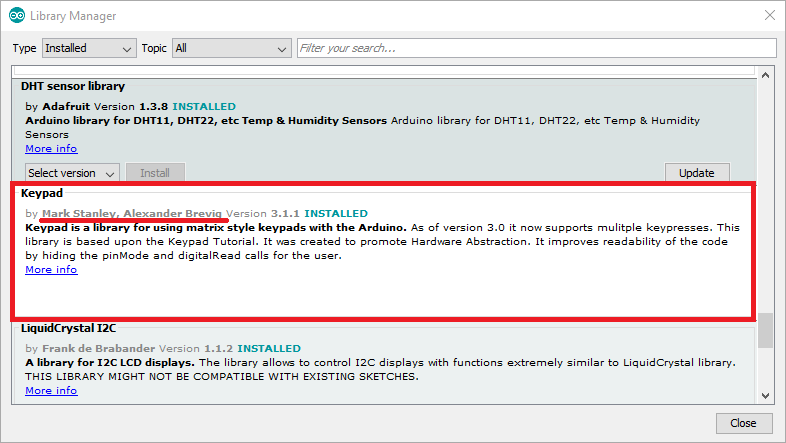
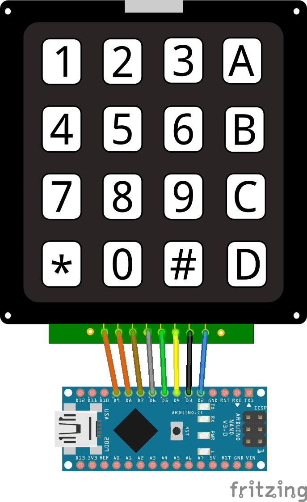

# Arduino Macro Keyboard

Crear macros puede ser muy fácil con un arduino Leonardo o Micro Pro. Sin embargo, puede que no tengas a tu disposición uno de estos. Podemos usar un arduino común y corriente comunicándolo con un script que haga las funciones de teclado. Para ello usaremos python.

En arduino, cada vez que presionemos una tecla enviará un caracter a través de Serial. Con python debemos capturar qué caracter fue y que acción de teclado se ejecutará. Esto para cada tecla del Keypad.

## Contenido

* [Requisitos](#requisitos)
* [Dependencias](#dependencias)
    * [pip](#actualizando-pip)
    * [pyserial](#pyserial)
    * [pyautogui](#pyautogui)
    * [Librería de arduino](#librería-de-arduino)
* [Esquema de conexión](#esquema-de-conexión)

## Requisitos

* [IDE de arduino](https://www.arduino.cc/en/Main/Software)
* [Python 3.x](https://www.python.org/)

## Dependencias

Es necesario intalar algunos requisitos para python antes de ejecutar el código.

### Actualizando pip

**Windows:** Ejecutar Power Shell / CMD como administrador

```shell
python -m pip install --upgrade pip
```

**Linux:** Ejecutar la terminal preferida

```
sudo python3 -m pip install --upgrade pip
```

### pyserial

Esta librería nos ayudarára con la comunicación entre el arduino y python a través del puerto serial.

```shell
python -m pip install pyserial
```

### pyautogui

Con pyautogui seremos capaces de "presionar" teclas a través de código.

```shell
python -m pip install pyautogui
```

### Librería de arduino

A través del administrador de librerías de Arduino debemos instalar **Keypad** de los autores **Mark Stanley** y **Alexander Brevig**.



## Esquema de conexión

Generalmente estos teclados suelen tener pines que representan las filas y las columnas de la matriz de pulsadores. Conectarás cada pin del teclado a un pin **digital** del arduino.



🧐 Para sugerencias o preguntas puedes contactarme[@crixodia](https://www.twitter.com/crixodia)